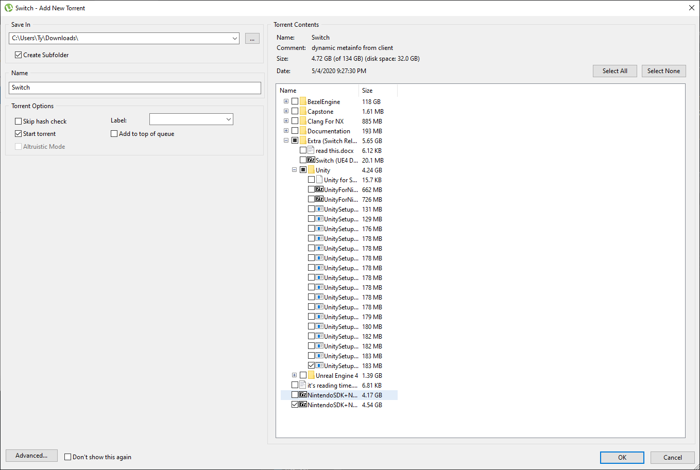
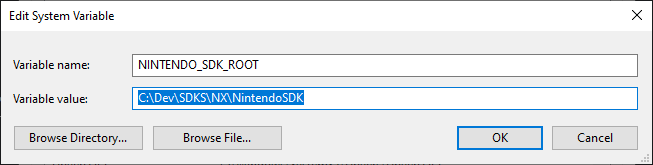

# SETUP

## SDK INSTALLATION
1. First extract everything from the link that I gave.
2. Double click the torrent file and download these ONLY:

3. When it's done downloading go ahead and extract "NintendoSDK+NWv9.2.0.7z" to a safe place (I have mine in C:\Dev\SDKS\NX).
4. Open environment variables, and add "NINTENDO_SDK_ROOT" to the system variables with the path to the NintendoSDK folder like this:
5. 
6. Open command prompt and cd into PATH_TO_YOUR_NINTENDO_SDK_FOLDER (mine is C:\Dev\SDKS\NX\NintendoSDK), then cd into Installers/TargetManager, run Install.bat and let it finish. then run "cd ..", cd into the VSI folder and run Install.bat and let it finish, then close command prompt.
7. Then go ahead and go to Tools/CommandLineTools/AuthoringTool and Rename AuthoringTool.exe to AuthoringToolO.exe (O not zero), then extract prodencrypt-Unity.zip to the folder and reboot your computer.

## UNITY INSTALLATION

1. Install Unity Hub and login into your Unity account.
2. Install Unity 2020.1.0b4
3. Go back to the "Switch" folder that you downloaded from the torrent, go into Extra (Switch Related)/Unity and you should see "UnitySetup-Nintendo-Switch-Support-for-Editor-2020.1.0b4.exe" double click it and install it.

## Making sure EVERYTHING works

1. In Unity Hub make a new empty 3d project, add a text component and then press on File > Build Settings and you SHOULD see Nintendo Switch as an option to switch to, if you don't try redoing the Unity Installation.
2. Switch to the Nintendo Switch build target and click on the toggle that says "Create NSP ROM file".
3. Try building the test project! If it works it should show you the nsp that it makes.
4. Test the nsp on any emulator of your choice!

Lets go to [What you need to know](WYNTK.md) next!
